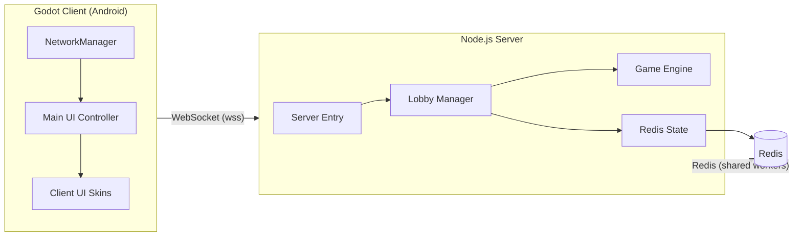

# Architecture

A map of every module in Corp Tower, one line each, with what it depends on
and a link to its own doc. See [[Summary]] for project status/context and
[[Component-Index]] for the same modules grouped as a flat link list.

## System shape

## Server (`src/Server`)

| Module | One-line | Depends on |
|---|---|---|
| [[Server Entry]] | WebSocket process entry point; routes messages | [[Lobby Manager]] |
| [[Lobby Manager]] | Matchmaking, room lifecycle, debug-config coordinator | [[Game Engine]], [[Game Config]], [[Bot Manager]] (indirect) |
| [[Game Engine]] | Authoritative per-room gameplay rules and level lifecycle | [[Game Config]], [[Tower Stability]], [[Bot Manager]], [[Lobby Manager]] (notify-only) |
| [[Tower Stability]] | Pure grid-settling and stability scoring | none |
| [[Bot Manager]] | Debug bot action scheduler | [[Game Config]], [[Game Engine]] |
| [[Game Config]] | Central tuning/config data object | none |
| [[Redis State]] | Shared-state adapter for multi-worker deploys, with in-memory fallback | `redis` (npm) |
| [[Balance Simulator]] | Offline balance-sampling CLI tool | [[Game Engine]], [[Game Config]], [[Tower Stability]] |
| [[Server Score Events Tests]] | Test coverage for scoring/summary contracts | [[Game Engine]], [[Game Config]], [[Lobby Manager]] |
| [[Server Docker Image]] | Container image for the server | — (see its own doc) |

## Client (`src/Client/App/corp-tower`)

| Module | One-line | Depends on |
|---|---|---|
| [[Godot Client App]] | The Godot project as a whole | [[NetworkManager]], [[Main UI Controller]] |
| [[NetworkManager]] | WebSocket adapter and signal bridge, autoloaded singleton | Godot `WebSocketPeer` |
| [[Main UI Controller]] | Main-screen UI controller: input, rendering, debug tuning | [[NetworkManager]], [[Block Preview]], [[Tower Stack]], [[Cooldown Overlay]], [[Debug Overlay]], [[Player Colors]] |
| [[Client UI Skins]] | Two swappable UI skin scenes + themes | [[Block Preview]], [[Tower Stack]], [[Cooldown Overlay]], [[Debug Overlay]] |
| [[Block Preview]] | Draws fixed-orientation block shape previews | none |
| [[Tower Stack]] | Draws the placed-block tower and its tilt animation | [[Player Colors]] |
| [[Cooldown Overlay]] | Radial per-card cooldown indicator | none |
| [[Debug Overlay]] | Debug panel show/hide shell | none |
| [[Player Colors]] | Shared player-id → color utility | none |
| [[Godot Client Tests]] | Smoke test + GUT coverage | [[Godot Client App]], [[NetworkManager]], [[Main UI Controller]], [[Client UI Skins]], [[Player Colors]] |

## Infrastructure & CI/CD

Audited at a lighter depth this pass (see the note in `CLEANUP_AUDIT_AND_PLAN.md`);
listed here for completeness, one line each, unchanged from before this
cleanup pass:

| Module | One-line |
|---|---|
| [[Client Android Internal Workflow]] | Builds/tests the Godot client, signs an internal Android build |
| [[Terraform Infrastructure]] | Terraform module map, including the deprecated Docker-staging path kept as history |
| [[Server K3s Stack]] | Active self-hosted K3s-on-EC2 server infrastructure |
| [[Server K3s Workflows]] | CI workflows that deploy/diagnose/clean up the K3s stack |
| [[Server K3s Automated Master Workflow]] | Orchestrates the individual K3s workflows |
| [[Server EKS Stack]] | Parallel, plan-only AWS EKS infrastructure path (not yet applied) |
| [[Server EKS Workflow]] | CI workflow for the EKS plan-only path |
| [[K3s Manual Learning Plan]] | Notes from manually learning the K3s stack |

## Global

- [[Summary]] — project status, current focus, "fast start" pointers
- [[Corp_Tower_GDD]] — game design document
- [[Corp_Tower_TDD]] — technical design document (system architecture,
  message contracts, testing strategy, future technical work)
- `Changelog` — linked from Summary and Component-Index, but not present as
  a file in this repo as of this pass (pre-existing gap, not introduced by
  this cleanup)
