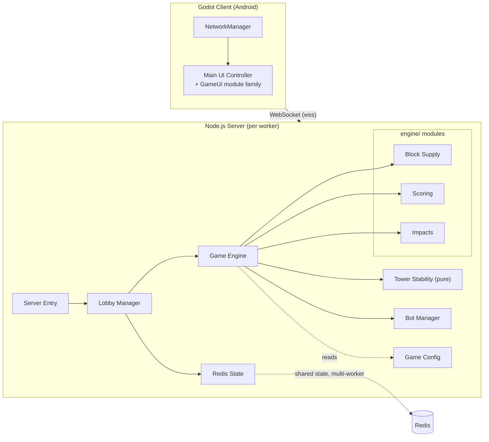

# Architecture

Scope: system shape, tech stack, runtime/message flow, repo layout. Per-module detail → [module-index.md](./module-index.md). Design rationale → [decisions.md](./decisions.md).

## System

3-player real-time multiplayer puzzle game. Godot Android client, authoritative Node.js WebSocket server, Redis shared state. Server is authoritative for all gameplay; client renders server state and never computes final outcomes locally.

| Layer | Stack |
|---|---|
| Client | Godot `4.6.2.stable`, GDScript, `WebSocketPeer` |
| Server | Node.js, `ws`, Redis (`redis` npm package, optional) |
| Shared state | Redis (multi-worker matchmaking/room/reconnect state) |
| Infra (active) | Terraform, K3s on EC2, Docker, Caddy |
| Infra (plan-only) | Terraform, EKS, NLB, ElastiCache |
| CI/CD | GitHub Actions |
| Public endpoint | `wss://ws.tod.galaxxigames.com` (Cloudflare DNS) |

## Runtime flow

1. Client connects to `wss://ws.tod.galaxxigames.com`. In the active K3s path, EC2-GW Caddy terminates WSS and reverse-proxies to private K3s node IPs on NodePort `30300`. In the plan-only EKS path, an internet-facing NLB with Elastic IPs would replace EC2-GW Caddy.
2. **Server Entry** accepts the connection and the first `reconnect` message, then hands the player to **Lobby Manager**.
3. **Lobby Manager** queues the player, creates/resumes a 3-participant room (filling with debug bots if enabled), and starts a **Game Engine** instance for that room.
4. **Game Engine** owns authoritative per-room gameplay — level lifecycle, timers, placement validation, Power system — delegating block supply, scoring, and Impact (checkpoint) logic to its `engine/` submodules, and grid/tilt physics to **Tower Stability** (a pure function).
5. **Redis State** (when `REDIS_URL` is set) backs the shared matchmaking queue and room snapshots so any worker can recover a room/player session; falls back to in-memory maps for single-worker/local runs.
6. Engine broadcasts `game_state` on every tick/change; client reflects it. Full contract → [networking.md](./networking.md).

## Repository layout

| Path | Contents | Detail doc |
|---|---|---|
| `src/Server/app/` | Everything the Docker image ships (deployed runtime) | [backend.md](./backend.md) |
| `src/Server/app/Server.js` | WebSocket entry point / message router | [networking.md](./networking.md#server-entry) |
| `src/Server/app/Lobby_Manager.js` | Matchmaking, rooms, reconnect, debug-config coordinator | [backend.md](./backend.md#lobby-manager) |
| `src/Server/app/Game_Engine.js` | Authoritative level lifecycle, timers, Power system | [backend.md](./backend.md#game-engine) |
| `src/Server/app/engine/Block_Supply.js` | Block gen, draw pile, opening hands, refresh | [backend.md](./backend.md#block-supply) |
| `src/Server/app/engine/Scoring.js` | Score events, bonuses, leaderboard, MVP, summaries | [backend.md](./backend.md#scoring) |
| `src/Server/app/engine/Impacts.js` | Impact snapshots, rollback, score gate | [backend.md](./backend.md#impacts) |
| `src/Server/app/Tower_Stability.js` | Pure grid-settling + stability scoring | [backend.md](./backend.md#tower-stability) |
| `src/Server/app/Bot_Manager.js` | QA bot action loops | [backend.md](./backend.md#bot-manager) |
| `src/Server/app/Game_Config.js` | Central tuning/config object | [backend.md](./backend.md#game-config), full variable table in [gameplay.md](./gameplay.md#debug-menu-and-live-tuning) |
| `src/Server/app/Redis_State.js` | Shared-state adapter, in-memory fallback | [backend.md](./backend.md#redis-state) |
| `src/Server/tools/Balance_Simulator.js` | Offline balance-sampling CLI (not shipped) | [testing.md](./testing.md#balance-simulator) |
| `src/Server/tests/Score_Events.test.js` | Score/summary contract tests (not shipped) | [testing.md](./testing.md#server-score-events-tests) |
| `src/Server/Dockerfile` | Server container image | [build.md](./build.md#server-container-image) |
| `src/Client/App/corp-tower/` | Godot project root | [ui.md](./ui.md) |
| `src/Client/App/corp-tower/Sys/NetMan/NetworkManager.gd` | WebSocket adapter, autoload singleton | [networking.md](./networking.md#networkmanager) |
| `src/Client/App/corp-tower/Cor/Scripts/Main.gd` | Main UI orchestrator | [ui.md](./ui.md#main-ui-controller) |
| `src/Client/App/corp-tower/Cor/Scripts/GameUi/` | UI module family (services + view controllers) | [ui.md](./ui.md#main-ui-controller) |
| `src/Client/App/corp-tower/Cor/Scenes/GameUI.tscn` | The one gameplay UI scene | [ui.md](./ui.md#game-ui-scene) |
| `.github/workflows/Client-Android-Internal.yml` | Android internal build/upload | [build.md](./build.md#client-android-internal-workflow) |
| `.github/workflows/Client-HTML5-Pages.yml` (+ `-Undeploy.yml`) | Web export deploy to GitHub Pages | [build.md](./build.md#client-html5-pages) |
| `.github/actions/fetch-private-assets/` | Pulls production art from R2 | [build.md](./build.md#private-asset-pipeline) |
| `.github/workflows/Server-K3s-*.yml` | K3s deploy/diagnostics/cleanup/infra | [deployment.md](./deployment.md#k3s-workflows) |
| `.github/workflows/Server-EKS-Infra-Plan.yml` | Plan-only EKS path | [deployment.md](./deployment.md#eks-plan-only) |
| `infra/k3s/` | Active K3s Terraform, Ansible, Kustomize, Argo bootstrap | [deployment.md](./deployment.md#k3s-topology) |
| `infra/eks/` | Plan-only EKS Terraform | [deployment.md](./deployment.md#eks-plan-only) |

## Subsystem boundaries

- **Client** talks only to **Server Entry**, over the WebSocket contract in [networking.md](./networking.md). It never computes gameplay outcomes — only renders `game_state` and sends intents.
- **Game Engine** never talks to Redis directly; **Lobby Manager** persists room snapshots through **Redis State** after the engine notifies it of a change.
- **Tower Stability** has zero internal or external dependencies — it's pure grid math, deliberately kept deterministic (see [decisions.md](./decisions.md)).
- **Balance Simulator** instantiates **Game Engine** directly, bypassing **Lobby Manager**/Redis/WebSocket entirely — it's a standalone tuning tool, not part of the runtime path.

## Current environment status

- **K3s** (`infra/k3s`): active, live staging traffic.
- **EKS** (`infra/eks`): Terraform plan-only, not applied. See [deployment.md](./deployment.md#eks-plan-only).
- Docker EC2 staging (EC2-1/2/3 + Ansible) has been fully removed; K3s superseded it.
