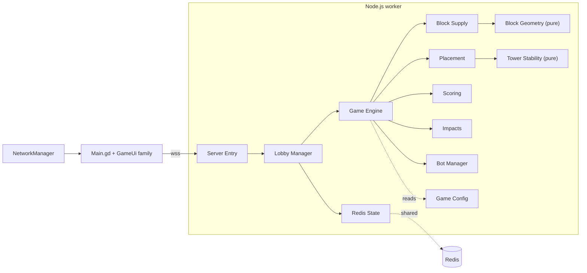

# Corp Tower — context entry

Router for the `docs/context/` knowledge base. Load **only** what the router
names. The full retrieval contract is in the root `AGENTS.md`.

## System

3-player real-time **selfish-cooperation** tower puzzle. Godot Android client,
authoritative Node.js WebSocket server, Redis shared state. The server is
authoritative; the client renders `game_state` and never computes an outcome.

| Layer | Stack |
|---|---|
| Client | Godot `4.6.2.stable`, GDScript, `WebSocketPeer` |
| Server | Node.js, `ws`, `redis` — entry `src/Server/app/Server.js` |
| Shared state | Redis — multi-worker matchmaking, rooms, reconnect |
| Infra | Terraform · EKS (production-grade, deploy-on-demand) · Docker · Cloudflare |
| CI/CD | GitHub Actions |

Flow: client connects to its build-injected endpoint → **Server Entry** accepts and
routes → **Lobby Manager** queues, creates or resumes a 3-seat room, starts a
**Game Engine** for it → the engine owns level lifecycle, timers, placement
validation and Power, delegating supply/scoring/Impacts to `engine/` modules and
placement/tower evaluation to `engine/Placement.js` and pure **Tower Stability** →
**Redis State** backs shared
matchmaking and room snapshots so any worker can recover a session → the engine
broadcasts `game_state` on every change.

Boundaries: the client talks only to Server Entry. Game Engine never touches Redis
— Lobby Manager persists through Redis State. Tower Stability has zero
dependencies and is deliberately pure. Balance Simulator constructs Game Engine
directly, bypassing lobby, Redis and the socket entirely.

## Task router

| Task | Load | Then grep |
|---|---|---|
| Gameplay rules, scoring, balance, tuning semantics | [gameplay.md](./gameplay.md) | [map/backend.md](./map/backend.md) |
| Server logic — rooms, engine, scoring, impacts, bots | [backend.md](./backend.md) | [map/backend.md](./map/backend.md) |
| WebSocket messages, payload shapes, reconnect wire | [networking.md](./networking.md) | both maps |
| New event or scoring type end-to-end — emit → wire → render | [networking.md](./networking.md) **first**, it owns the type list | both maps |
| Godot client screens, navigation, shell, network bootstrap | [ui.md](./ui.md) | [map/ui-screens.md](./map/ui-screens.md) |
| Godot client HUD, stack rendering, popovers, debug panel | [ui-hud.md](./ui-hud.md) | [map/ui-hud.md](./map/ui-hud.md) · [map/ui-debug.md](./map/ui-debug.md) |
| Godot client tutorial layer | [ui-tutorial.md](./ui-tutorial.md) | [map/ui-tutorial.md](./map/ui-tutorial.md) |
| Shared deploy overview and secrets | [deployment.md](./deployment.md) | [map/infra.md](./map/infra.md) |
| EKS topology, Terraform and production deploys | [deployment-eks.md](./deployment-eks.md) | [map/infra.md](./map/infra.md) |
| Physical backup host, demo deploys and recovery | [deployment-backup.md](./deployment-backup.md) | [map/infra.md](./map/infra.md) |
| CI build, Android, HTML5, private art pipeline | [build.md](./build.md) | [map/infra.md](./map/infra.md) |
| Tests, balance simulator, CI gates | [testing.md](./testing.md) | — |
| Agent retrieval, context bundles and automated task close-out | [automation.md](./automation.md) | — |
| "Which file does X?" | — | the matching map |
| Editing these docs | `update-docs` · `compact-docs` skills | — |
| `site/` — the portfolio, a separate Worker and its own KB | [`site/docs/index.md`](../../site/docs/index.md) | — |
| `site-root/` — apex-domain Worker, no game code | its own README | — |

Each domain doc states its scope on line 1. Docs describe how the system behaves
now and what it still cannot do — not how it got here. There is no history doc.

## Working rules

Repo-wide invariants — server authority, no comments in product source, don't
commit — are in the root `AGENTS.md` and are not repeated here. These are the
rules for writing *these docs*.

- **One owning doc per concept.** Edit that doc, never a second copy.
- **Docs own knob _semantics_; `Game_Config.js` owns knob _values_.** Mirroring a
  number into prose is this KB's most common drift class. Write a value down only
  when it drives design conversation on its own; otherwise give name, meaning and
  shape, and let the reader open `Game_Config.js`.
- Config keys appear in exact code-identifier form, never paraphrased.
- Docs change only under the `update-docs` or `compact-docs` skill, and edits **replace**
  prose rather than append to it.

## Aliases

Chat logs, branches and old PRs use the left column; the system uses the right.

| Term used | Means |
|---|---|
| Politics | **Power** — quests, items, activation |
| Checkpoint | **Impact** — score gate and rollback (`Impacts.js`) |
| Refresh / `free_refresh` | **Replenish** — tops up the shared draw pile |
| Lane | **Column** on the level's derived **site** |
| `anchorX` | retired — a dragged brick's geometry sets its column |
| `Checkpoints.js` | `Impacts.js` |
| K3s lab / EC2-GW / `infra/k3s` / `K3s-*.yml` | retired — EKS is the only AWS target; hostnames `wsplaytod`, `wstodtest`, `playtod`, `todtest` went with it |
| `Android-Deploy-wsplaytod.yml` | `Android-Deploy-wstodplay.yml` — now targets EKS |

## Ignore map

Godot generated (`*.uid`, `*.import`, `*.tres`, `.godot/`) · third-party and
lockfiles (`addons/`, `node_modules/`, `package-lock.json`) · Terraform state
(`.terraform/`, `*.tfstate*`) · assets and binaries, including private art under
`Cor/Art/` · `plan/`, `TOD*` hand-off files, export output. Read `tests/`,
`Tests/` and `*.tscn` only when working that area.

`README.md` is a pitch for human readers — design intent in plain language, no
contracts or numbers. It is not a KB doc and never a source of truth for one.
